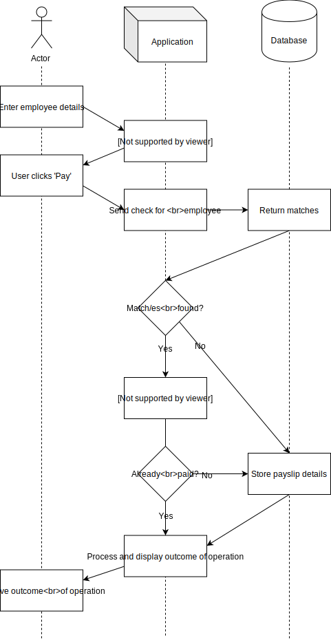
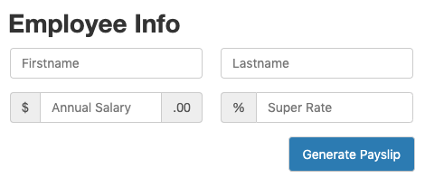
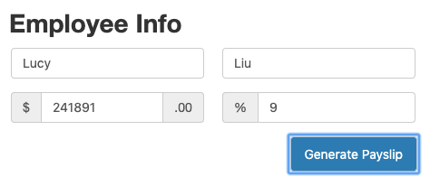
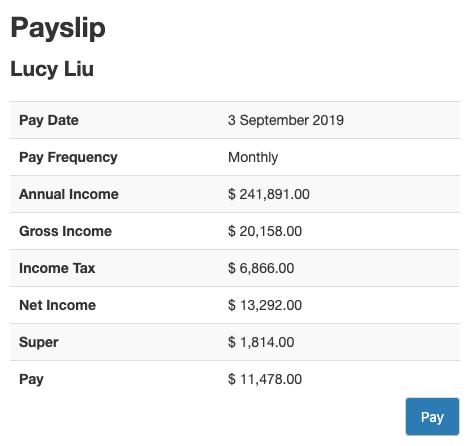
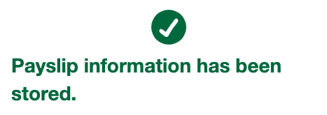
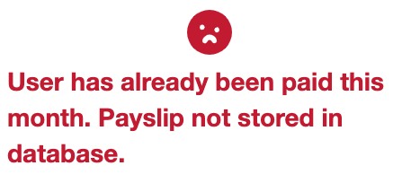

# MYOB Code Challenge 2019 (Nathalia M. Tan)

## Overview
### THE CHALLENGE: HR PAYROLL SYSTEM
When I input the employee's details: first name, last name, annual salary and super rate, the program should generate a payslip information with name, pay period, gross income, income tax, net income and super. The program should store the payslip information internally for audit purposes. It should also prevent me from paying an employee who already received payment for the month.

The calculation details will be the following:
- pay period = per calendar month
- gross income = annual salary / 12 months
- income tax = based on the tax table provided in the PDF
- net income = gross income - income tax
- super = gross income x super rate
- pay = net income - super

Notes: All calculation results should be rounded to the whole dollar. If >= 50 cents round up to the next dollar increment, otherwise round down.

### TECHNICAL REQUIREMENTS
- The program has two parts:
    - Front end web app can be written using any framework.
    - Back end server can be any chosen language.
- When the 'Generate Payslip' button is clicked the user is shown the generated payslip which is computed on the client side.
- When the 'Pay' button is clicked. The user information is sent to the backend server where the payslip information is stored on the server for audit purposes

## Developer notes
### Assumptions
_List any assumptions that you have made in order to solve this problem._

- Names are entered exactly as they are in the database
    - e.g.: Nathalia is not equal to NATHALIA
- When searching for a payee, the program uses the first entry found in the database matching first and last name
- Tax rates for 2012 - 2013 apply

### Technology stack
_List the reasons for your choice in technology stack._

#### UML Sequence Diagram

- Front End
    - HTML/CSS/Javascript
    - [jQuery](https://jquery.com/)
        - Makes for more readable code, and simplified Javascript
- Tooling
    - [npm](https://www.npmjs.com/)
        - Most familiar with npm (over Grunt/Gulp/Yarn/etc.)
    - [Express](https://expressjs.com/en/starter/static-files.html)
        - Easy to set up
        - Prevents CORS issues caused due to `type="module"` attribute on Javascript script tags
    - [Jest](https://jestjs.io)
        - Simple test framework for Javascript
    - [Netlify](https://www.netlify.com/)
        - Free and simple to use
- Back End
    - [Amazon Web Services (AWS)](https://aws.amazon.com)
        - Already have AWS account
        - Have used AWS for numerous other projects
    - [AWS API Gateway](https://aws.amazon.com/api-gateway/)
        - Allows easy configuration to set up an API
        - Works well within AWS ecosystem
    - [AWS DynamoDB](https://aws.amazon.com/dynamodb/)
        - AWS-based database, easily accessible via AWS' API Gateway

### Running the application
_Provide instructions on how to run the application._

Please note that you must be connected to the internet for the program to run successfully (even when running locally) - both the API and database are hosted on AWS.

__Locally:__ From the CLI, run `node server.js`. In a browser, navigate to `localhost:3000`.

__Live:__ https://unruffled-minsky-7bbadc.netlify.com/

Once you have navigated to the page successfully, proceed to fill out details of an employee:
- First name
- Last name
- Annual salary
    - Whole number (rounded)
- Super rate
    - Enter this as a percentage value (e.g.: 9, 9.5)

Click the 'Generate Payslip' button once you are happy with the above values. The program will bring you to a screen displaying the generated payslip.

If you would like to proceed, click the 'Pay' button. The program will then check to see if this employee has been paid in this month.

If the employee has not been paid this month, you will be brought to a success screen notifying you that they have been paid!

If the employee has been paid, you will be brought to an error screen notifying you that they have been paid this month and therefore will not be paid again. The payslip will not be stored in the database.

### Testing
_Provide a test harness to validate your solution._

From the CLI, run `npm run test`. Only financial functions are tested.
UI is not tested. Tests are written within the [Jest](https://jestjs.io) test framework.

## Future improvements
- Refactor DynamoDB structure to use lastName as primary key (rather than firstName)
- More robust searching
    - Name transformation (search with toUpperCase() or toLowerCase()) when searching and storing names
    - Convert name to sentence case on display of payslip (this can have some issues with names containing multiple components, e.g.: McDonald, de Souza, Smith-Jones, etc.)
- Refactor Javascript to use Payee object
- `HAS_ROUNDING` flag in `CONST` to enable/disable rounding of dollar values
- Reset/'Generate another' buttons
- [Use toLocaleString() for date](https://stackoverflow.com/questions/1643320/get-month-name-from-date/18648314#18648314)
- More sophisticated validation on form (super cannot be already in percentage format (e.g.: 0.09 instead of 9), reasonable super rates)

## Resources
- Styles adapted from [Bootstrap](https://getbootstrap.com/docs/3.3/components/)
- [AWS API Gateway and DynamoDB](https://aws.amazon.com/blogs/compute/using-amazon-api-gateway-as-a-proxy-for-dynamodb/)
- [Listing multiple resources in an IAM role](https://forums.aws.amazon.com/thread.jspa?threadID=220021)
- [The API must be deployed/redeployed once the CORS support settings have been updated](https://docs.aws.amazon.com/apigateway/latest/developerguide/how-to-cors.html)
- UML diagram made in [Draw.io](https://www.draw.io/)
- [Favicon Gallery](https://www.favicon-generator.org/search/TURQUIOSE/)
